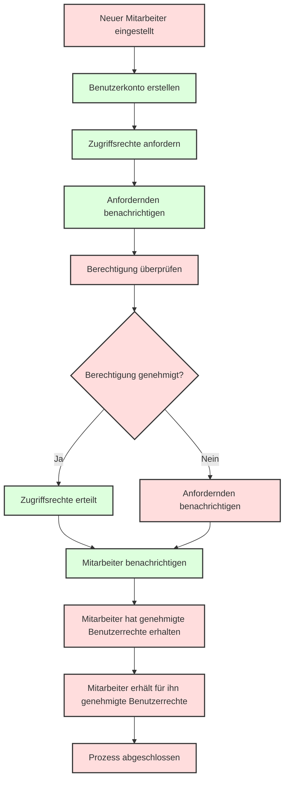

```mermaid
flowchart TB
    A[Neuer Mitarbeiter eingestellt] --> B[Benutzerkonto erstellen]
    B --> C[Zugriffsrechte anfordern]
    C --> D[Anfordernden benachrichtigen]
    D --> E[Berechtigung überprüfen]
    E --> F{Berechtigung genehmigt?}
    F -->|Ja| G[Zugriffsrechte erteilt]
    F -->|Nein| H[Anfordernden benachrichtigen]
    G --> I[Mitarbeiter benachrichtigen]
    H --> I
    I --> J[Mitarbeiter hat genehmigte Benutzerrechte erhalten]
    J --> K[Mitarbeiter erhält für ihn genehmigte Benutzerrechte]
    K --> L[Prozess abgeschlossen]

    classDef event fill:#ffdddd,stroke:#333,stroke-width:2px;
    classDef function fill:#ddffdd,stroke:#333,stroke-width:2px;
    class A,B,C,D,E,F,G,H,I,J,K,L event;
    class B,C,D,G,I function;
```
