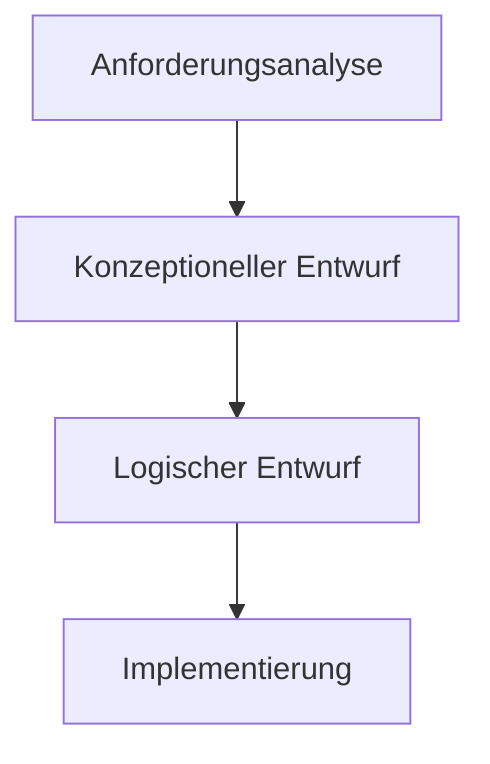
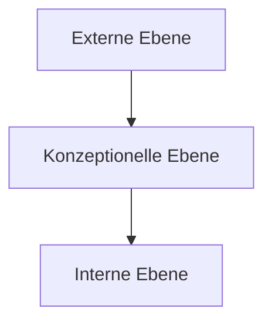
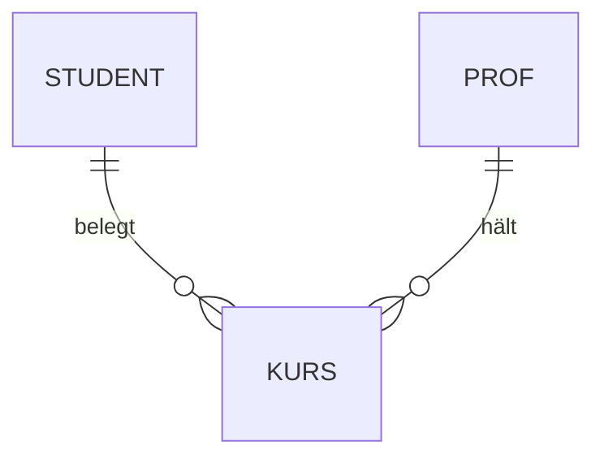
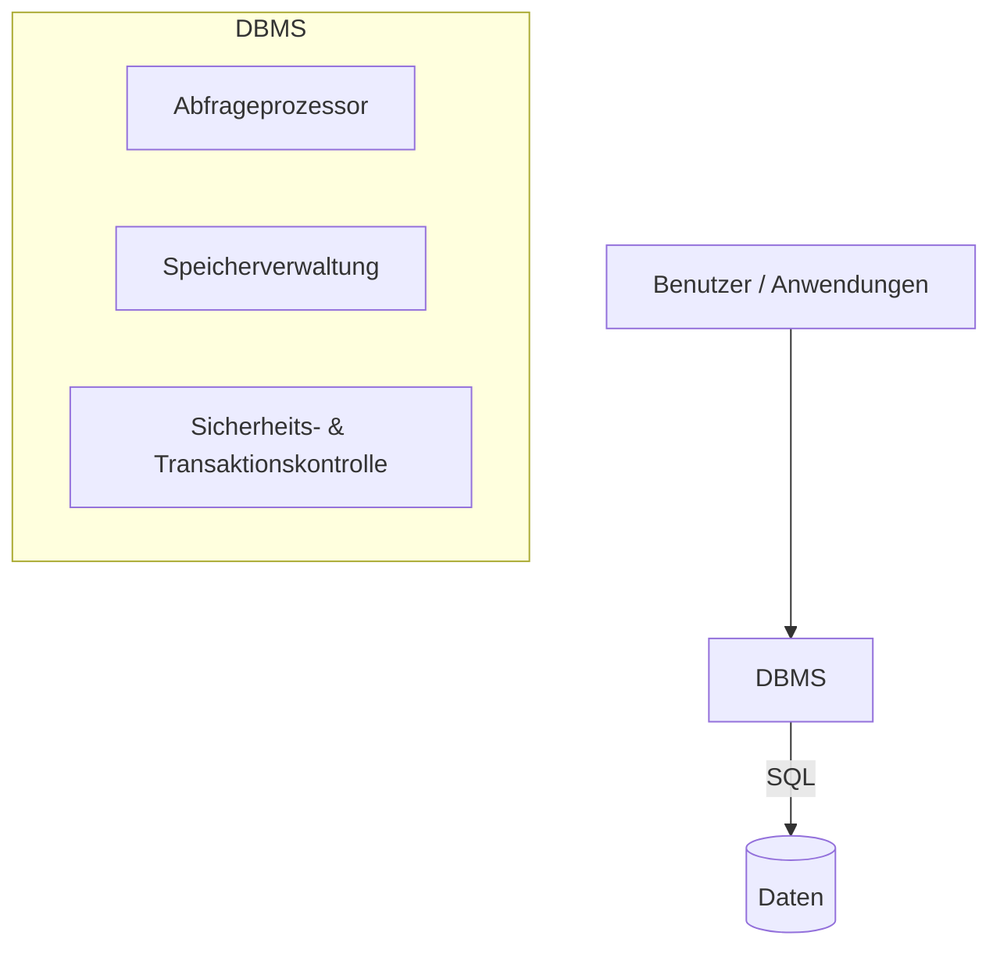

# 📘 Datenbanksysteme – Zusammenfassung (Test FI-A 46_LF8IT)

> **Hinweis:** Diese Datei ist für **Obsidian** optimiert.  
> Sie enthält Übersichten, Tabellen, Diagramm-Ideen (Mermaid), und Strukturierungen der Themen.

---

## 1. Grundlagen DBMS

### Definition
- **DBMS (Datenbankmanagementsystem)** = Software zur Verwaltung von Datenbanken  
- **DB (Datenbank)** = Sammlung strukturierter Daten  
- **DBS (Datenbanksystem)** = Kombination aus **DBMS + DB**

### Wichtige Eigenschaften
- Vermeidet **direkten Zugriff** auf die Datenbank
- Stellt **Abfragesprache** (SQL) bereit
- **Nicht korrekt**: „Das DBMS ist aufgeteilt in Datenbank und Datenbanksystem“

---

## 2. Phasen des Datenbankentwurfs



### Übersicht der Tätigkeiten

|Phase|Tätigkeiten|
|---|---|
|**Anforderungsanalyse**|- Ermittlung benötigter Daten  <br>- Erfassung von Benutzergruppen & -rechten|
|**Konzeptioneller Entwurf**|- Modell der Datenstruktur (ER-Modell)  <br>- Welche DB-Art soll verwendet werden?|
|**Logischer Entwurf**|- Normalisierung  <br>- Umsetzung ins logische Modell|
|**Implementierung**|- Datenbanken erzeugen  <br>- Benutzer/Gruppen anlegen  <br>- Rechte festlegen  <br>- Daten importieren|

---

## 3. ANSI-SPARC-Modell (3-Ebenen-Modell)


|Ebene|Aufgaben/Funktionen|
|---|---|
|**Externe Ebene**|- Benutzergruppen/Rechte  <br>- Views für Benutzer|
|**Konzeptionelle Ebene**|- Tabellenschema  <br>- Logisches Schema der Daten|
|**Interne Ebene**|- Physische Speicherung  <br>- Datenaufteilung auf Platten|

---
## 4. Entity-Relationship-Modell (ERM)

### Kardinalitäten

- **1:1** → eine Entität entspricht genau einer anderen
- **1:n** → eine Entität A kann mehreren Entitäten B zugeordnet sein    
- **m:n** → mehrere Entitäten A stehen in Beziehung zu mehreren Entitäten B



---

## 5. Aufbau eines Datenbanksystems



- **Abfrageprozessor**: verarbeitet SQL-Befehle
- **Speicherverwaltung**: Zugriff auf Datenspeicher
- **Sicherheit/Transaktionen**: Rechteverwaltung & Konsistenz

---

## 6. Typische Prüfungsfragen (Checkliste)

- ✅ Welche Aussage ist **nicht zutreffend** über DBMS?
- ✅ Ordnen der Tätigkeiten den Entwurfsphasen
- ✅ ANSI-SPARC-Modell (Zuordnung)
- ✅ Kardinalitäten (m:n, 1:n, 1:1)
- ✅ Aufbau des DB-Systems (Komponenten richtig platzieren)

---

## 7. Quick-Recap (Lernkarte-Style)

```dataview
table phase as "Phase", aufgabe as "Typische Aufgabe"
from ""
where contains(file.tags, "dbms")
flatten choice(phase, "Anforderungsanalyse", "Konzeptioneller Entwurf", "Logischer Entwurf", "Implementierung")
flatten choice(aufgabe, "Ermittlung Daten", "ER-Modell erstellen", "Normalisierung", "Rechte anlegen")

```

---

# ✅ Fazit

Mit dieser Zusammenfassung hast du:
- alle **Phasen** des Entwurfs im Überblick
- **ANSI-SPARC-Modell** klar getren
- **Kardinalitäten** visualisiert
- den **DBMS-Aufbau** verständlich im Diagramm

Perfekt als **Spickzettel** oder **Lernzettel in Obsidian**.